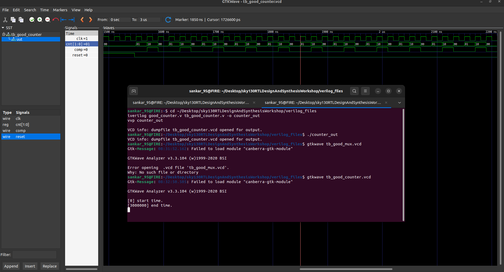

# 🌟 Day 1 – Introduction to Verilog RTL Design & Synthesis  

<div align="center">


</div>

Welcome to **Day 1** of the **RISC-V SoC Tapeout RTL Workshop** 🚀  
Today marks the beginning of our design journey with **Verilog, Icarus Verilog (iverilog)**, and **Yosys synthesis**.  
We’ll explore essential RTL concepts, run hands-on labs, and build the foundation for complete digital design flow.  

---

## 📚 Table of Contents
1. [Simulator, Design & Testbench](#1-simulator-design--testbench)  
2. [Getting Started with iverilog](#2-getting-started-with-iverilog)  
3. [Lab: 2-to-1 Multiplexer Simulation](#3-lab-2-to-1-multiplexer-simulation)  
4. [Verilog Code Walkthrough](#4-verilog-code-walkthrough)  
5. [Yosys & Gate Libraries](#5-yosys--gate-libraries)  
6. [Lab: Synthesis with Yosys](#6-lab-synthesis-with-yosys)  
7. [Day 1 Summary](#7-day-1-summary)  

---

## 1️⃣ Simulator, Design & Testbench  

### 🔹 Simulator  
A **simulator** verifies the functionality of your circuit by applying test inputs and observing outputs—saving you from hardware errors.  

### 🔹 Design  
The **design** is your Verilog description of the intended logic.  

### 🔹 Testbench  
The **testbench** is a virtual lab environment that feeds inputs to your design and validates outputs.  

<div align="center">
  
</div>

---


## 2. Getting Started with iverilog

**iverilog** is an open-source simulator for Verilog. Here’s the typical simulation flow:

<div align="center">
  
</div>

- Both the design and testbench are provided as input to iverilog.
- The simulator produces a `.vcd` file for waveform viewing in GTKWave.

---

## 3. Lab: Simulating a 4 bit Counter

Let’s simulate a simple **4 bit Counter** using iverilog!

###  Step 1: Clone the Workshop Repository

```shell
git clone https://github.com/kunalg123/sky130RTLDesignAndSynthesisWorkshop.git
cd sky130RTLDesignAndSynthesisWorkshop/verilog_files
```

###  Step 2: Install Required Tools

```shell
sudo apt install iverilog
sudo apt install gtkwave
```

###  Step 3: Simulate the Design

Compile the design and testbench:

```shell
cd ~/Desktop/sky130RTLDesignAndSynthesisWorkshop/verilog_files
iverilog good_counter.v tb_good_counter.v -o counter_out vvp counter_out
    

```

Run the simulation:

```shell
./counter.out
```

View the waveform:

```shell
gtkwave tb_good_mux.vcd
```

<div align="center">
  
</div>

---

## 4. Verilog Code Analysis

**The code for the multiplexer (`good_mux.v`):**

```verilog
module good_counter (input clk , input reset , output reg [1:0] cnt);
wire comp;

assign comp = (cnt == 2'b10);

always @(posedge clk , posedge reset)
begin
	if(reset)
		cnt <= 2'b00;
	else if(comp)
		cnt <= 2'b00;
	else
		cnt <= cnt+1;
end

endmodule
```

###  **How It Works**

# 4-bit Counter

- **Inputs:**
  - `clk` → Clock signal  
  - `reset` → Active-high reset  

- **Output:**
  - `count[3:0]` → 4-bit counter value  

- **Logic:**  
  - On every rising edge of `clk`:  
    - If `reset = 1` → `count` is reset to `0000`.  
    - Else → `count` increments by `1` (`count = count + 1`).  


---

## 5. Introduction to Yosys & Gate Libraries

###  What is Yosys?

**Yosys** is a powerful open-source synthesis tool for digital hardware. It takes your Verilog code and converts it into a gate-level netlist—a hardware blueprint.

#### Yosys Features

- **Synthesis:** Converts HDL to a logic circuit
- **Optimization:** Improves speed or area
- **Technology Mapping:** Matches logic to actual hardware cells
- **Verification:** Checks correctness
- **Extensibility:** Supports custom flows

###  Why Do Libraries Have Different Gate "Flavors"?

A `.lib` file contains many versions of each gate (like AND, OR, NOT) with different properties:

- **Performance:** Faster gates for critical paths, slower for power savings
- **Power:** Some gates use less energy
- **Area:** Smaller gates for compact chips
- **Drive Strength:** Stronger gates to drive more load
- **Signal Integrity:** Specialized gates for noise/performance
- **Mapping:** Synthesis tools pick the best flavor for your needs
  <div align="center">
  
</div>

---

## 6. Synthesis Lab with Yosys
  <div align="center">
  
</div>

Let’s synthesize the `good_counter` design using Yosys!

###  Step-by-Step Yosys Flow

1. **Start Yosys**
    ```shell
    yosys
    ```

2. **Read the liberty library**
    ```shell
    read_liberty -lib /address/to/your/sky130/file/sky130_fd_sc_hd__tt_025C_1v80.lib
    ```

3. **Read the Verilog code**
    ```shell
    read_verilog /home/vsduser/VLSI/sky130RTLDesignAndSynthesisWorkshop/verilog_files/good_mux.v
    ```

4. **Synthesize the design**
    ```shell
    synth -top good_mux
    ```

5. **Technology mapping**
    ```shell
    abc -liberty /address/to/your/sky130/file/sky130_fd_sc_hd__tt_025C_1v80.lib
    ```

6. **Visualize the gate-level netlist**
    ```shell
    show
    ```

<div align="center">
  
</div>
---

## 7. Summary

- You learned about simulators, designs, and testbenches.
- You ran your first Verilog simulation with iverilog and visualized waveforms.
- You analyzed the 2-to-1 mux code.
- You explored Yosys and learned why gate libraries have various flavors.

