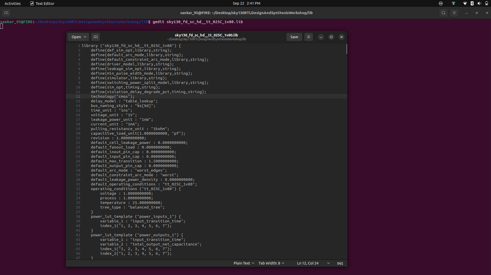
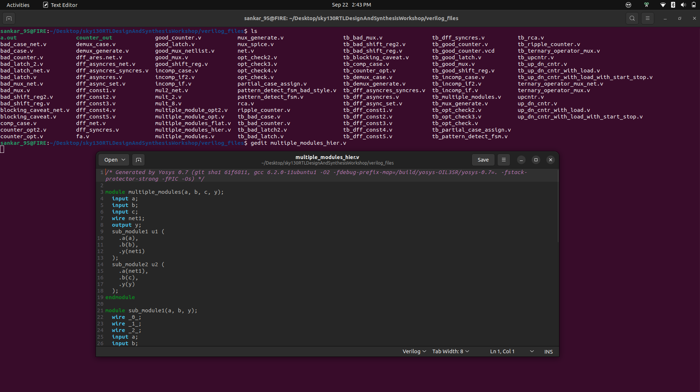
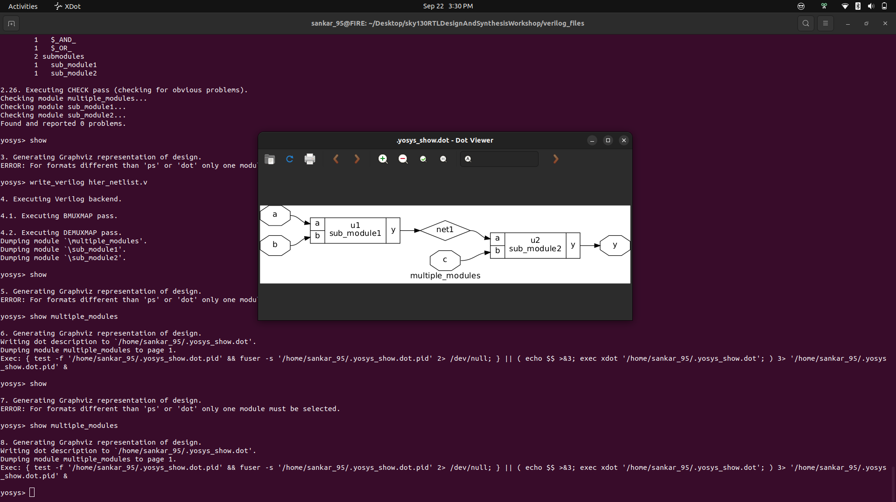
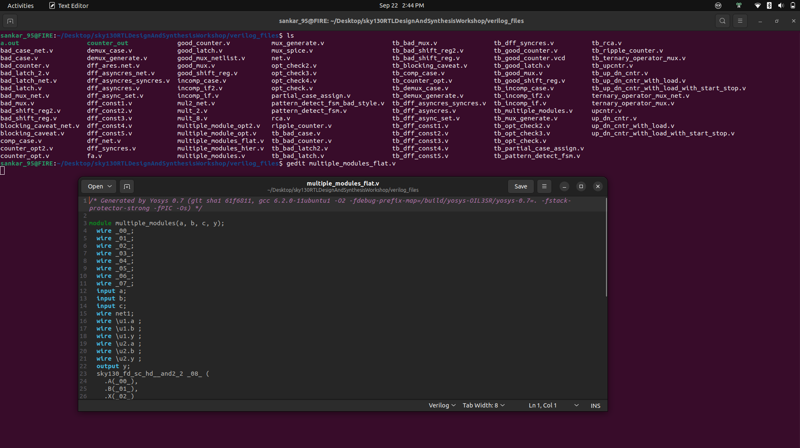
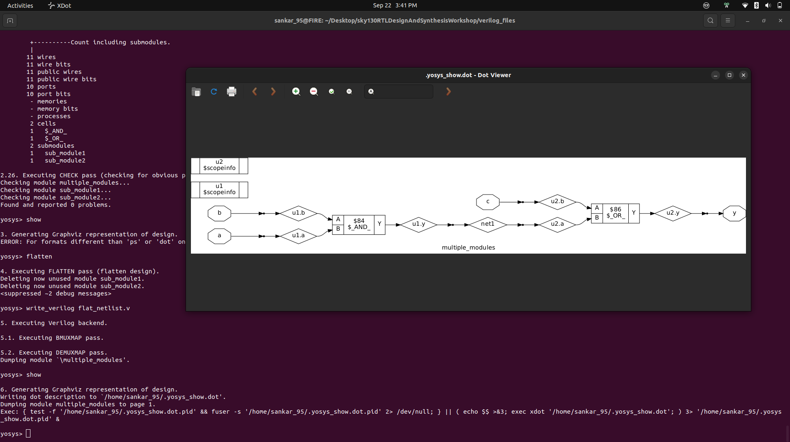
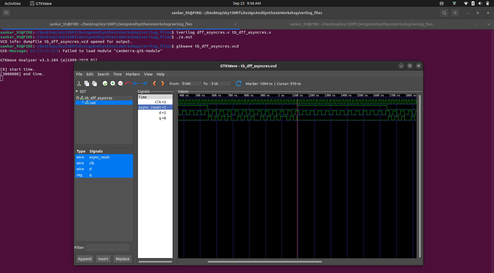
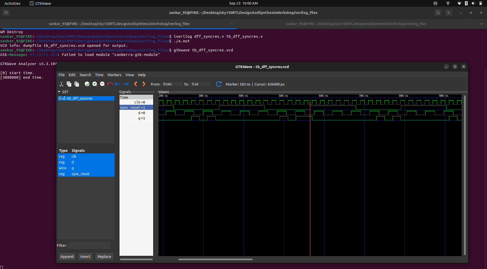
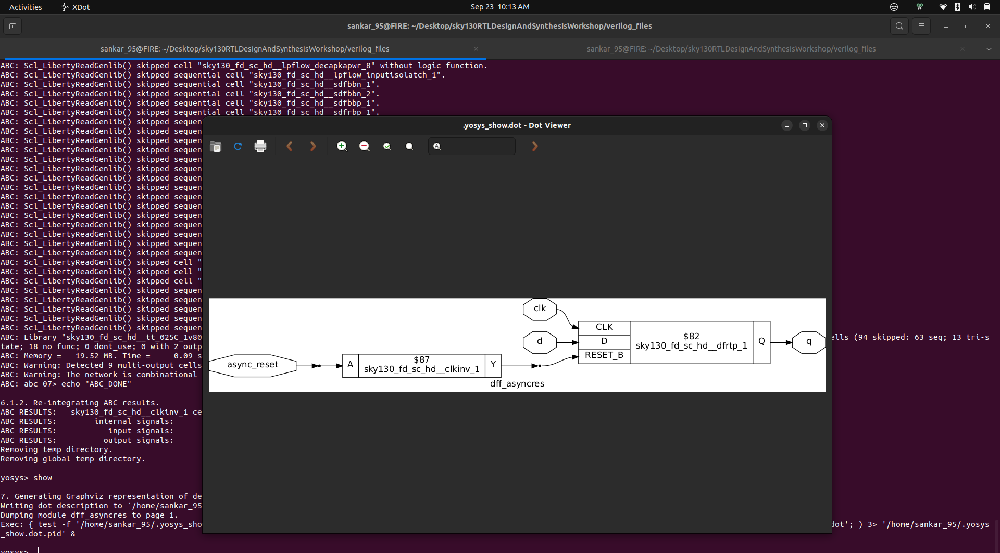

# ⚡ Day 2 – Timing Libraries, Synthesis Approaches & Flip-Flop Coding  

<div align="center">

        

</div>

Welcome to **Day 2** of the RTL Workshop 🌟.  
Today’s focus: mastering **timing libraries**, understanding **hierarchical vs. flat synthesis**, and applying **efficient flip-flop coding styles** for robust digital design.  

---

## 📚 Contents

- [⏱️ Timing Libraries](#️-timing-libraries)  
  - [SKY130 PDK Overview](#sky130-pdk-overview)  
  - [Decoding tt_025C_1v80](#decoding-tt_025c_1v80)  
  - [Opening the .lib File](#opening-the-lib-file)  

- [🏗️ Hierarchical vs. Flattened Synthesis](#️-hierarchical-vs-flattened-synthesis)  
  - [Hierarchical Synthesis](#hierarchical-synthesis)  
  - [Flattened Synthesis](#flattened-synthesis)  
  - [Key Differences](#key-differences)  

- [🔁 Flip-Flop Coding Styles](#-flip-flop-coding-styles)  
  - [Asynchronous Reset DFF](#asynchronous-reset-d-flip-flop)  
  - [Asynchronous Set DFF](#asynchronous-set-d-flip-flop)  
  - [Synchronous Reset DFF](#synchronous-reset-d-flip-flop)  

- [⚙️ Simulation & Synthesis Workflow](#️-simulation--synthesis-workflow)  
  - [Simulation with Icarus Verilog](#simulation-with-icarus-verilog)  
  - [Synthesis with Yosys](#synthesis-with-yosys)  

- [✅ Summary](#-summary)  

---

## ⏱️ Timing Libraries  

### SKY130 PDK Overview  
The **SKY130 PDK** is an open-source CMOS technology kit at **130nm node**.  
It provides **timing, power, and process variation models**, essential for IC design.  

---

### Decoding **tt_025C_1v80**  
The naming convention of `.lib` files encodes **process-voltage-temperature (PVT)** corners:  

| Code | Meaning |
|------|---------|
| `tt` | Typical process corner |
| `025C` | 25°C operating temperature |
| `1v80` | 1.8 V supply voltage |

This ensures accurate modeling across real-world scenarios.  

---

### Opening the `.lib` File  

1. Install an editor:  
   ```bash
   sudo apt install gedit

   ```
2. **Open the file:**
   ```shell
   gedit sky130_fd_sc_hd__tt_025C_1v80.lib
   ```
 <div align="center">
  
</div>


---

## Hierarchical vs. Flattened Synthesis

### Hierarchical Synthesis

- **Definition**: Retains the module hierarchy as defined in RTL, synthesizing modules separately.
- **How it Works**: Tools like Yosys process each module independently, using commands such as `hierarchy` to analyze and set up the design structure
- **Description:** Preserves RTL structure. Synthesizes modules independently.

- **Pros:**
  - ✅ Faster for large designs
  - ✅ Easier debugging (traceable to RTL)
  - ✅ Modular and reusable

- **Cons:**
  - ❌ Limited cross-module optimizations
  - ❌ Requires additional reporting setup


# Read Standard Cell Library
```shell
read_liberty -lib ../lib/sky130_fd_sc_hd__tt_025C_1v80.lib
```
# Read RTL File
```shell
read_verilog good_mux.v
```
# Check & Setup Hierarchy
```shell
hierarchy -check -top good_mux
```
# Synthesize Design
```shell
synth -top good_mux
```
# Generate Hierarchical Netlist
```shell
write_verilog -noattr good_mux_netlist_hier.v
```

**Example:**
<div align="center">
  
</div>

This version:  
- Adds **sections** (Inputs, Wires, Nets, Outputs).  
- Highlights the **cell instantiation** (`sky130_fd_sc_hd__and2_2`).  
- Escapes unusual identifiers like `\u1.a`.  
- Presents hierarchy cleanly for **reports/GitHub README**.  


<div align="center">
  
</div>


---

### Flattened Synthesis

- **Definition**: Merges all modules into a single flat netlist, eliminating hierarchy.
- **How it Works**: The `flatten` command in Yosys collapses the hierarchy, allowing whole-design optimizations.
- **Description:** Collapses hierarchy into a single flat netlist. Optimizes across modules.

- **Pros:**
  - ✅ Aggressive global optimization
  - ✅ Unified netlist

- **Cons:**
  - ❌ Slower runtime
  - ❌ Debugging harder (lost hierarchy)
  - ❌ Larger memory footprint

# Generate Flattened Netlist
```shell
flatten
write_verilog -noattr good_mux_netlist_flat.v
```
**Example:**

<div align="center">
  
</div>


This version:  
- Adds **sections** (wires, inputs, nets, outputs).  
- Highlights the **cell instantiation** (`sky130_fd_sc_hd__and2_2`).  
- Escapes weird identifiers like `\u1.a`.  

---


<div align="center">
  
</div>


> **Important:** Hierarchical synthesis maintains sub-modules in the design, while flattening produces a netlist from the ground up.

---

### Key Differences: Hierarchical vs Flattened Synthesis

| **Aspect**            | **Hierarchical 🧩**                  | **Flattened 🏗️**              |
|-----------------------|------------------------------------|--------------------------------|
| **Hierarchy**          | Preserved                           | Collapsed                     |
| **Optimization Scope** | Module-level                        | Global                         |
| **Runtime**            | ⚡ Faster (ideal for big SoCs)      | 🐢 Slower                      |
| **Debugging**          | 🛠️ Easier                           | 🔍 Harder                       |
| **Netlist Style**      | Modular                             | Single block                   |
| **Use Case**           | ✅ Debug, modular flows             | 🚀 Max performance             |

---

## Flip-Flop Coding Styles

Flip-flops are fundamental sequential elements in digital design, used to store binary data. Below are efficient coding styles for different reset/set behaviors.

### Asynchronous Reset D Flip-Flop

```verilog
module dff_asyncres (input clk, input async_reset, input d, output reg q);
  always @ (posedge clk, posedge async_reset)
    if (async_reset)
      q <= 1'b0;
    else
      q <= d;
endmodule
```
- **Asynchronous reset**: Overrides clock, setting q to 0 immediately.
- **Edge-triggered**: Captures d on rising clock edge if reset is low.

### Asynchronous Set D Flip-Flop

```verilog
module dff_async_set (input clk, input async_set, input d, output reg q);
  always @ (posedge clk, posedge async_set)
    if (async_set)
      q <= 1'b1;
    else
      q <= d;
endmodule
```
- **Asynchronous set**: Overrides clock, setting q to 1 immediately.

### Synchronous Reset D Flip-Flop

```verilog
module dff_syncres (input clk, input async_reset, input sync_reset, input d, output reg q);
  always @ (posedge clk)
    if (sync_reset)
      q <= 1'b0;
    else
      q <= d;
endmodule
```
- **Synchronous reset**: Takes effect only on the clock edge.

---

## Simulation and Synthesis Workflow

### Icarus Verilog Simulation

1. **Compile:**
   ```shell
   iverilog dff_asyncres.v tb_dff_asyncres.v
   ```
2. **Run:**
   ```shell
   ./a.out
   ```
3. **View Waveform:**
   ```shell
   gtkwave tb_dff_asyncres.vcd
   ```
   
   ---
   
### Asynchronous Reset Simulation
- When the asyn_res = 1, the Q = 0.
- Even when clk = 1.
- It does not wait for the clk to be 1.
<div align="center">
  
</div>

---

### Synchronous Reset Simulation
- When the syn_res = 1, the Q = 0 only at clk = 1
- only when clk = 1.
- It always waits for the clk to be 1.
  <div align="center">
  
</div>

---

### Synthesis with Yosys

1. Start Yosys:
   ```shell
   yosys
   ```
2. Read Liberty library:
   ```shell
   read_liberty -lib ..//lib/sky130_fd_sc_hd__tt_025C_1v80.lib
   ```
3. Read Verilog code:
   ```shell
   read_verilog dff_asyncres.v
   ```
4. Synthesize:
   ```shell
   synth -top dff_asyncres
   ```
5. Map flip-flops:
   ```shell
   dfflibmap -lib ..//lib/sky130_fd_sc_hd__tt_025C_1v80.lib
   ```
6. Technology mapping:
   ```shell
   abc -liberty ..//lib/sky130_fd_sc_hd__tt_025C_1v80.lib
   ```
7. Visualize the gate-level netlist:
   ```shell
   show
   ```
<div align="center">
  
</div>


---
## Summary
This overview provides you with practical insights into timing libraries, synthesis strategies, and reliable coding practices for flip-flops. Continue experimenting with these concepts to deepen your understanding of RTL design and synthesis.
