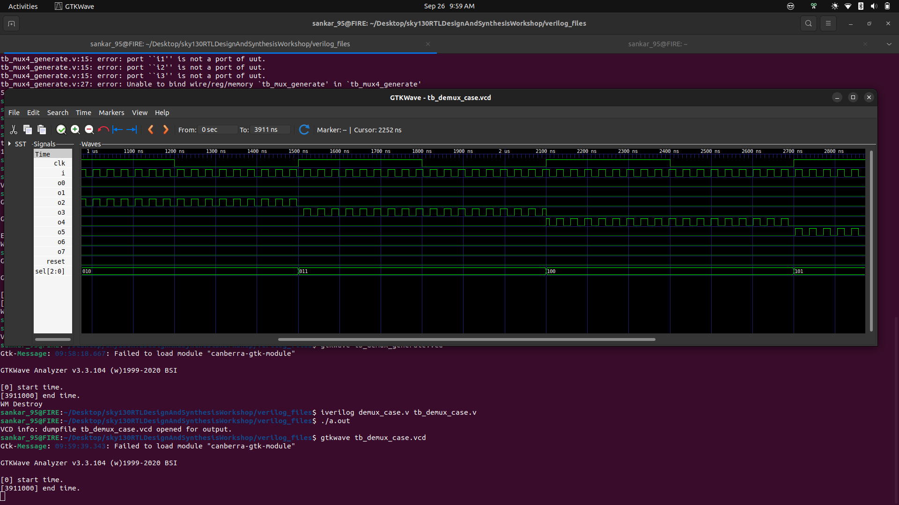

# ⚡ Day 5: Turbocharge Your Verilog – Optimization Mastery in Synthesis! ⚡

<div align="center">

         


🌟 **Welcome, RTL Wizards!** 🌟  
Buckle up for **Day 5** of our electrifying RTL Design & Synthesis Workshop. We're cranking up the creativity dial to explore **Verilog synthesis optimizations** – from dodging sneaky latches to wielding `if-else`, `case`, `for` loops, and `generate` blocks like a pro. Get ready for fun labs, pro tips, and hardware hacks that make your designs sleek, efficient, and latch-free! 🚀  

> **Epic Quest:** Transform clunky code into silicon symphonies. Let's synthesize some magic! ✨

</div>  

---

## 📘 Contents – Your Roadmap to RTL Glory  

1. [If-Else Statements: Decision-Making Dynamos](#1-if-else-statements-in-verilog)  
2. [Inferred Latches: The Hidden Hardware Hazards](#2-inferred-latches-in-verilog)  
3. [Labs: Conquer If-Else & Case Challenges](#3-labs-on-if-else-and-case-statements)  
4. [For Loops: Loop Your Way to Scalable Logic](#4-for-loops-in-verilog)  
5. [Generate Blocks: Build Like a Boss at Compile Time](#5-generate-blocks-in-verilog)  
6. [Ripple Carry Adder (RCA): The Chain-Reaction Hero](#6-what-is-an-rca-ripple-carry-adder)  
7. [Labs: Loops, Generates, & Adder Adventures](#7-labs-on-loops-and-generate-blocks)  
8. [Summary: Level Up Your Synthesis Skills](#summary)  

---

## 1️⃣ If-Else Statements: Decision-Making Dynamos 🧠  

In the Verilog universe, **if-else constructs** are your trusty sidekicks for conditional logic inside procedural blocks (think `always` or `initial`). They decide which path your hardware takes – like a choose-your-own-adventure for gates!  

```verilog
if (condition) begin
   // Boom! Condition true? Fire up this block! 💥
end else begin
   // Nah? Pivot to this backup plan. 🛡️
end
```

✔️ **Pro Hacks for Peak Performance**:  
- **Cover All Bases**: Handle every scenario to avoid surprises.  
- **Latch-Proof Your Code**: Always pair with `else` – it's your safety net!  
- **Multi-Branch Magic**: For complex choices, swap to `case` for cleaner, more readable code.  

**Fun Fact**: Think of `if-else` as a traffic light – green for go, red for stop, and no amber ambiguity! 🚦

---

## 2️⃣ Inferred Latches: The Hidden Hardware Hazards ⚠️  

Picture this: Your combinational logic looks perfect, but synthesis sneaks in a latch because a signal got ghosted in some path. **Inferred latches** are those unintended memory elements – great for flip-flops, disastrous for pure logic!  

🔴 **Villain Code (Latch Lurking)**:  
```verilog
always @(a, b, sel) begin
   if (sel)
      y = a;   // Uh-oh! What happens when sel=0? Crickets... and a latch! 😱
end
```

🟢 **Hero Code (Latch-Busted)**:  
```verilog
always @(a, b, sel) begin
   if (sel) y = a;
   else     y = b;  // Victory! Every path covered. 🎉
end
```

💡 **Golden Rule**: In combinational blocks, assign **EVERY** signal in **EVERY** path. It's like feeding all your pets – no one gets left out! 🐶🐱

---

## 3️⃣ Labs: Conquer If-Else & Case Challenges 🛠️  

Dive into these interactive labs to battle latches and master conditionals. (Pro tip: Simulate first, synthesize second – catch those bugs early! Check Day 1 for setup steps.)  

### Lab 1: Incomplete If (Latch Alert!)  
```verilog
module incomp_if (input i0, input i1, input i2, output reg y);
always @(*) begin
    if (i0)
        y <= i1;   // ❌ Missing else? Latch party incoming!  
end
endmodule
```

📸 **Output Snapshot**:  
<p align="center">
   
</p>

---

### Lab 2: Synth Result of Lab 1  
📸 **Synthesis Shenanigans**:  
<p align="center">
   
</p>
(Spot the latch? It's hiding in plain sight!)

---

📸 **Lab 3 : GLS of Incomp_if**: 

<p align="center">
   
</p>

---

### Lab 4: Synth Result of Lab 3  
📸 **More Synthesis Drama**:  

<p align="center">
   
</p>

---


### Lab 5: Incomplete Case (Danger Zone!)  
```verilog
module bad_case (
    input i0, input i1, input i2, input i3,
    input [1:0] sel,
    output reg y
);
always @(*) begin
    case(sel)
        2'b00: y = i0;
        2'b01: y = i1;
        // ❌ No default? You're playing with fire! 🔥  
    endcase
end
endmodule
```

📸 **Output Snapshot**:  
<p align="center">
   
</p>

---

### Lab 6: Synth Result of Lab 5  
📸 **Clean Synthesis Win**:  
<p align="center">
   
</p>

---

## Lab 7: Complete Case Statement  
```verilog
module comp_case (input i0, input i1, input i2, input [1:0] sel, output reg y);
always @(*) begin
    case(sel)
        2'b00: y = i0;
        2'b01: y = i1;
        default: y = i2;  // ✅ Default to the rescue – no latches here!  
    endcase
end
endmodule
```
### Synth Result of Lab 5  
📸 **Clean Synthesis Win**:  
<p align="center">
   
</p>


📸 **Output Snapshot**:  
<p align="center">
   
</p>

---

### Lab 8: Partial Assignments in Case  
```verilog
module partial_case_assign (
    input i0, input i1, input i2,
    input [1:0] sel,
    output reg y, output reg x
);
always @(*) begin
    case(sel)
        2'b00: begin
            y = i0;
            x = i2;
        end
        2'b01: y = i1; // ❌ x forgotten? Latch alert!
        default: begin
            x = i1;
            y = i2;
        end
    endcase
end
endmodule
```

### Synth Result of Lab 5  
📸 **Clean Synthesis Win**:  
<p align="center">
   
</p>

# Synthesis Summary

## Synthesized Netlist (Schematic)

### MUX2 (sky130_fd_sc_hd__mux2_1)
- Selects between `i0` and `i1` based on `sel[0]` when `sel[1] = 0`.
- Matches the cases:
  - `sel = 00`: `y = i0`
  - `sel = 01`: `y = i1`

### AOI / AND-OR Gates (`a221o`, `and3b`, `nor2`, `nand2b`)
- Handle the default case (`sel = 10` or `11`).
- Generate:
  - `y = i2`
  - `x = i1`

### DLATCH (`$_DLATCH_P_`)
- Inserted by synthesis because `x` is not assigned in every branch (missing in `sel = 01`).
- Infers a latch to "remember" the last value of `x` when `sel = 01`.

## Boolean Simplification

### For `y`:
```
y = (~sel[1] & ~sel[0] & i0)  // sel=00 → y=i0
  | (~sel[1] &  sel[0] & i1)  // sel=01 → y=i1
  | ( sel[1]           & i2); // sel=1x → y=i2
```

### For `x`:
```
if (sel == 00) x = i2;
else if (sel == 10 or 11) x = i1;
else x = latch (holds value);
```

## Conclusion
- The synthesized logic matches the RTL case statement.
- The `DLATCH` is inferred because `x` is not assigned in `sel = 01`, requiring storage to hold the previous value.

---

### Lab 10: Partial Assignments in Case  
```verilog
module bad_case (input i0 , input i1, input i2, input i3 , input [1:0] sel, output reg y);
always @(*)
begin
	case(sel)
		2'b00: y = i0;
		2'b01: y = i1;
		2'b10: y = i2;
		2'b1?: y = i3;
		//2'b11: y = i3;
	endcase
end

endmodule
```

### Synth Result of Lab 5  
📸 **Clean Synthesis Win**:  
<p align="center">
   
</p>

📸 **Output Snapshot**:  
<p align="center">
   
</p>


---


## 4️⃣ For Loops: Loop Your Way to Scalable Logic 🔄  

**For loops** are your secret weapon for repeating patterns in procedural blocks. But for synthesis superpowers, keep iterations fixed – no dynamic drama!  

```verilog
for (i=0; i<4; i=i+1) begin
   if (i == sel)
      y = data[i];  // Loop-de-loop to select the winner! 🏆 
end
```

✔️ **Epic Use Cases**: Muxes, demuxes, array ops – perfect for scaling without copy-paste madness.  
**Twist**: Imagine it as a conveyor belt churning out logic – efficient and endless fun! 🛤️  

### Example: 2-to-1 MUX with For Loop  
```verilog
module mux_generate (input i0 , input i1, input i2 , input i3 , input [1:0] sel  , output reg y);
wire [3:0] i_int;
assign i_int = {i3,i2,i1,i0};
integer k;
always @ (*)
begin
for(k = 0; k < 4; k=k+1) begin
	if(k == sel)
		y = i_int[k];
end
end
endmodule


```

📸 **Output Snapshot**:  
<p align="center">
   
</p>

---

### Example: 4-to-1 MUX with For Loop  
```verilog
module mux_4to1_for_loop (
    input wire [3:0] data, // Party of 4 inputs
    input wire [1:0] sel,  // DJ select
    output reg y           // The chosen one
);
    integer i;
    always @(data, sel) begin
        y = 1'b0; // Start neutral
        for (i = 0; i < 4; i = i + 1) begin
            if (i == sel)
                y = data[i]; // Match? You're it!
        end
    end
endmodule
```

📸 **Output Snapshot**:  
<p align="center">
   
</p>

---

## 5️⃣ Generate Blocks: Build Like a Boss at Compile Time 🏗️  

**Generate blocks** let you craft hardware replicas during compilation. Team up with `genvar` and loops for modular masterpieces!  

```verilog
genvar i;
generate
   for(i=0; i<8; i=i+1) begin : FA_LOOP
      full_adder fa_inst (.a(num1[i]), .b(num2[i]), .c(cin[i]), .sum(sum[i]), .co(cout[i]));  // Build it brick by brick! 🧱  
   end
endgenerate
```

✔️ **Prime Use Cases**: Adders, multipliers, memory arrays – go parametric for ultimate flexibility.  
**Pro Tip**: It's like 3D printing your RTL – customize on the fly! 🖨️  

---


## 🎭 The Showdown: For Loop vs. For Generate

| Feature                | For Loop                              | For Generate                          |
|------------------------|---------------------------------------|---------------------------------------|
| **Where It Lives**     | Inside procedural blocks (`always`, `initial`) | Outside procedural blocks, in module scope |
| **What It Does**       | Controls simulation-time behavior     | Builds hardware structures before simulation |
| **Execution Time**     | During simulation (runtime)           | During elaboration (before simulation) |
| **Output**             | Simulation actions (e.g., assignments) | Hardware instances (e.g., modules, wires) |
| **Think Of It As**     | A chef cooking pizzas on the fly 🍕   | An architect drafting a city blueprint 🏙️ |
| **Use Case**           | Initializing arrays, iterative logic   | Replicating modules or connections    |


## 🌟 Creative Mnemonic to Remember
- **For Loop**: “Flowing in time, looping through actions.” It’s a performer 🎤 on stage, acting out steps during the show (simulation).
- **For Generate**: “Generating hardware, building the stage.” It’s the stage crew 🛠️ setting up props *before* the show starts.

## 🚀 Pro Tip: When to Use Which?
- Use **for loop** when you need to iterate during simulation, like initializing a memory or computing values in a testbench.
- Use **for generate** when you need to replicate hardware, like creating multiple ALUs or wiring up a bus.
  

---

###6️⃣ DEMUX CASE and GENERATE coding styles

**Example: DEMUX with Case**  
```verilog
module mux_4to1_for_loop (
    input wire [3:0] data, // Party of 4 inputs
    input wire [1:0] sel,  // DJ select
    output reg y           // The chosen one
);
    integer i;
    always @(data, sel) begin
        y = 1'b0; // Start neutral
        for (i = 0; i < 4; i = i + 1) begin
            if (i == sel)
                y = data[i]; // Match? You're it!
        end
    end
endmodule
```

📸 **Output Snapshot**:  
<p align="center">
   
</p>

📸 **Clean Synthesis Win**:  
<p align="center">
   
</p>


**Example: DEMUX with For Loop**  
```verilog
module mux_4to1_for_loop (
    input wire [3:0] data, // Party of 4 inputs
    input wire [1:0] sel,  // DJ select
    output reg y           // The chosen one
);
    integer i;
    always @(data, sel) begin
        y = 1'b0; // Start neutral
        for (i = 0; i < 4; i = i + 1) begin
            if (i == sel)
                y = data[i]; // Match? You're it!
        end
    end
endmodule
```

📸 **Output Snapshot**:  
<p align="center">
   
</p>

📸 **Clean Synthesis Win**:  
<p align="center">
   
</p>


## Comparison Table

| Feature                  | Case Statement                                   | For Loop                                      |
|--------------------------|--------------------------------------------------|-----------------------------------------------|
| **Coding Style**         | Uses a `case` or `casez` statement in an `always` block to assign outputs based on select signal values. | Uses a `for` loop in an `always` block to iterate over outputs and assign the input to the selected one. |
| **Readability**          | Explicit and clear for small demuxes (e.g., 1:2 or 1:4). Each case is manually defined, making it easy to follow. | More concise for larger demuxes (e.g., 1:8 or 1:16). Less verbose but may be less intuitive for beginners. |
| **Scalability**          | Tedious for large demuxes, as each case must be written out manually, increasing code length. | Scales well for large demuxes, as the loop automatically handles all outputs with minimal code. |
| **Synthesis**            | Synthesizes to combinational logic (e.g., muxes or AND/OR gates). May infer latches if outputs are not fully specified. | Synthesizes to combinational logic. Ensures all outputs are assigned in each iteration, reducing risk of latches. |
| **Code Example**         | ```verilog<br>always @(sel or in) begin<br>  out = 0;<br>  case (sel)<br>    2'b00: out[0] = in;<br>    2'b01: out[1] = in;<br>    2'b10: out[2] = in;<br>    2'b11: out[3] = in;<br>  endcase<br>end<br>``` | ```verilog<br>always @(sel or in) begin<br>  out = 0;<br>  for (int i = 0; i < 4; i++) begin<br>    if (i == sel) out[i] = in;<br>  end<br>end<br>``` |
| **Use Case**             | Best for small demuxes or when specific control over each case is needed (e.g., custom output conditions). | Ideal for large demuxes or when the output pattern is regular, reducing repetitive code. |
| **Flexibility**          | Highly flexible for non-standard output assignments or additional logic per case. | Less flexible for irregular patterns but cleaner for standard demux behavior. |
| **Potential Pitfalls**   | Risk of inferred latches if not all cases are covered or outputs aren’t initialized (e.g., missing `default`). | Must ensure proper initialization (e.g., `out = 0`) to avoid latches; loop logic must be precise. |

---

## 7️⃣ Ripple Carry Adder (RCA): The Chain-Reaction Hero 🌊  

The **Ripple Carry Adder (RCA)** is the classic adder squad: A chain of full adders where carries "ripple" through like dominoes. Simple for small bits, but watch that delay wave in big designs!  

📸 **Visual Vibes**:  


**Why It Rocks**: Easy to implement, but for speed freaks, level up to carry-lookahead! ⚡  

---

##  Labs: Loops, Generates, & Adder Adventures 🎮 

Level up with these labs – loop, generate, and add your way to victory! (Setup in Day 1.)  

### Lab 9: 4-to-1 MUX using For Loop  
```verilog
module mux_generate (
    input i0, input i1, input i2, input i3,
    input [1:0] sel,
    output reg y
);
wire [3:0] i_int;
assign i_int = {i3, i2, i1, i0};
integer k;
always @(*) begin
    for (k = 0; k < 4; k = k + 1) begin
        if (k == sel)
            y = i_int[k];
    end
end
endmodule
```

📸 **Loop Magic in Action**:  


### Lab 10: 8-to-1 Demux using Case  
```verilog
module demux_case (
    output o0, output o1, output o2, output o3,
    output o4, output o5, output o6, output o7,
    input [2:0] sel,
    input i
);
reg [7:0] y_int;
assign {o7, o6, o5, o4, o3, o2, o1, o0} = y_int;
always @(*) begin
    y_int = 8'b0;
    case(sel)
        3'b000 : y_int[0] = i;
        3'b001 : y_int[1] = i;
        3'b010 : y_int[2] = i;
        3'b011 : y_int[3] = i;
        3'b100 : y_int[4] = i;
        3'b101 : y_int[5] = i;
        3'b110 : y_int[6] = i;
        3'b111 : y_int[7] = i;
    endcase
end
endmodule
```

📸 **Case Conquest**:  


### Lab 11: 8-to-1 Demux using For Loop  
```verilog
module demux_generate (
    output o0, output o1, output o2, output o3,
    output o4, output o5, output o6, output o7,
    input [2:0] sel,
    input i
);
reg [7:0] y_int;
assign {o7, o6, o5, o4, o3, o2, o1, o0} = y_int;
integer k;
always @(*) begin
    y_int = 8'b0;
    for (k = 0; k < 8; k = k + 1) begin
        if (k == sel)
            y_int[k] = i;
    end
end
endmodule
```

📸 **Loopy Demux Delight**:  


### Lab 12: 8-bit Ripple Carry Adder using Generate  
```verilog
module rca (
    input [7:0] num1,
    input [7:0] num2,
    output [8:0] sum
);
wire [7:0] int_sum;
wire [7:0] int_co;

genvar i;
generate
    for (i = 1; i < 8; i = i + 1) begin
        fa u_fa_1 (.a(num1[i]), .b(num2[i]), .c(int_co[i-1]), .co(int_co[i]), .sum(int_sum[i]));
    end
endgenerate

fa u_fa_0 (.a(num1[0]), .b(num2[0]), .c(1'b0), .co(int_co[0]), .sum(int_sum[0]));

assign sum[7:0] = int_sum;
assign sum[8] = int_co[7];
endmodule

module fa (input a, input b, input c, output co, output sum);
    assign {co, sum} = a + b + c; // Math magic!
endmodule
```

📸 **Adder Assembly Line**:  


**Bonus Quest**: Scale Lab 12 to 16 bits – how does the delay change? Experiment and share your results!

---

## ✅ Summary: Level Up Your Synthesis Skills 📈  

| **Concept**         | **Key Insight**                  | **Best Practice**                     | **Emoji Boost** |
|---------------------|----------------------------------|---------------------------------------|----------------|
| **If-Else**         | Cover all paths                 | Always use `else`                     | 🛡️            |
| **Case**            | Avoid partial cases             | Always include `default`              | ✅            |
| **Latches**         | Unintentional & risky           | Eliminate by full assignments         | ⚠️            |
| **For Loop**        | Scalable structures             | Fixed iteration count only            | 🔄            |
| **Generate**        | Hardware replication            | Use with `genvar`                     | 🏗️            |
| **RCA**             | Simple adder chain              | Watch out for propagation delay       | 🌊            |

💡 **Day 5 Takeaway**:  
Clean Verilog = Latch-free bliss, optimal gates, and hardware that hums! 🎶 
🔗 **Design Smart. Synthesize Safe. Optimize Always.**  

Ready for **Day 6**? Keep the RTL fire burning! 🔥
